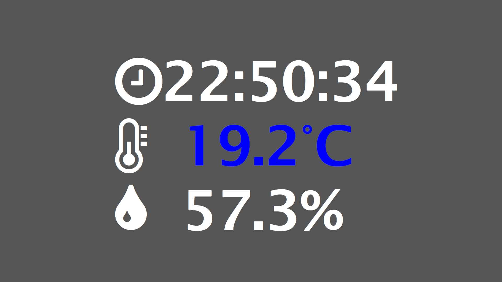

基于树莓派的多环境检测解决方案
------------------------------
## 概述

基于树莓派平台，使用nginx+flask+python3，用于实时监测周边环境的解决方案，具有系统可靠、维护简单方便的优点。

## 模块

* 后台：[Flask](<http://flask.pocoo.org/> "Flask")
* 前端：HTML CSS JS
* 第三方：[JQurey](<http://jquery.com/> "JQuery")，[Font-awsome-icons](<https://fontawesome.com/icons?from=io> "Font-awsome-icons")，[Adafruit_DHT](<https://github.com/adafruit/Adafruit_Python_DHT > "Adafruit_DHT")

## 预览

# API接口

地址：/api/gettmp

方法：get

返回：json格式数据，示例：

> {"humidity": 59.2, "temperature": 19.2}

hunidity:实时湿度数据

temperature:实时温度数据

## 文件概述

* 工作目录：/usr/share/nginx
   * uwsgi.ini：uwsgi的配置文件
   * nginx.conf：nginx启动配置文件

* 网站后台目录：/usr/share/nginx/html

  * mail.py：邮件发送模块，由/usr/share/nginx/html/static/config.json配置
  * main.py：后台主模块
  * myproject.log：后台运行日志
  * run.py：后台运行启动入口
  * history.py：历史记录模块
  * history.json：历史记录文件，示例：
  >{"temperature": [19.3, 19.4, 19.4, 19.4, 19.4, 19.4, 19.4, 19.4], "time": ["23:22:39", "23:22:40", "23:22:41", "23:22:42", "23:22:43", "23:22:44", "23:22:46", "23:22:47"], "humidity": [67.2, 67.5, 67.5, 67.6, 67.5, 67.6, 67.5, 67.6]}

* 网站前端页面目录：/usr/share/nginx/html/static

  * config.json：系统配置文件

    * 页面数据相关 html：
      * update_time：web页面数据更新时间间隔，单位毫秒
      * temperature_high：温度上限
      * temperature_low：温度下限
      * humidity_high：湿度上线
      * humidity_low：湿度下线
    * 邮件相关 smtp：
      * server：smtp服务器地址    e.g. smtp.qq.com
      * port：smtp服务器端口    e.g. 587
      * user：系统管理员登录用户名    e.g. 872700000@qq.com
      * password：登录密码
      * to：邮件目标地址

    * 历史记录相关 data_record：
      * frequency：记录间隔时间，单位毫秒
      * max：记录数据最大个数

  * style.css：网页样式css文件

## 系统使用命令示例

`cd /usr/share/nginx`

`sudo uwsgi --ini uwsgi.ini &`

`sudo nginx -c nginx.conf`

